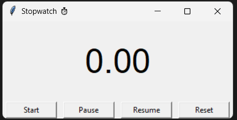

# ⏱️ Stopwatch (Tkinter GUI)

A simple **Stopwatch application** built with **Python Tkinter**.  
It supports **Start, Pause, Resume, and Reset** functionalities with a clean interface.

---

## 📌 Features
- 🟢 **Start** → Starts the stopwatch.  
- ⏸️ **Pause** → Pauses the time without resetting.  
- ▶️ **Resume** → Continues counting from where it left off.  
- 🔄 **Reset** → Resets the stopwatch to `0.00`.  
- Updates every **10 milliseconds** for smooth precision.  

---

## ⚙️ How It Works
- Uses `time.time()` to measure elapsed time.  
- Maintains two states:
  - `running` → Whether stopwatch is active.  
  - `paused` → Whether stopwatch is paused.  
- Time is accumulated in `final_time` to handle multiple pauses/resumes.  

---

## ▶️ Example Usage

### Run the Program
```bash
python stopwatch.py
```
## GUI

- Start → Stopwatch begins.

- Pause → Time freezes.

- Resume → Time continues from where paused.

- Reset → Clears everything back to 0.00.


## 🖼️ Screenshot (Example UI)
<div align="center">
  


</div>

## 🚀 Requirements

- Python 3.x

- Tkinter (pre-installed with Python)

## Author
Made with ❤️ by Pratyaksh 