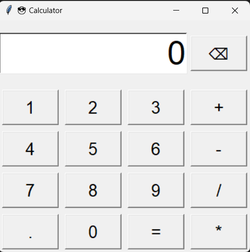

# 🧮 Calculator (Tkinter GUI)

A stylish and user-friendly **Calculator** built with **Python Tkinter**.  
It supports **basic arithmetic operations**, decimal inputs, and includes a **backspace button** for corrections.

---

## 📌 Features
- ✅ Addition (`+`), Subtraction (`-`), Multiplication (`*`), Division (`/`)  
- ✅ Handles decimal inputs  
- ✅ **Backspace (⌫)** → Delete last digit/operator  
- ✅ **Error Handling** → Displays "Error" for invalid expressions  
- ✅ Clean, modern UI with emoji title 😎  

---

## ⚙️ How It Works
- Maintains a running string `expression` as user inputs digits/operators.  
- When `=` is pressed, evaluates using Python’s `eval()`.  
- On errors (like division by zero, invalid syntax), shows `"Error"` and resets expression.  
- Backspace removes the last character from the current input.  

---

## ▶️ Example Usage

### Run the Program
```bash
python calculator.py
```
## Gui Layout

<div align="center">



</div>

- Enter numbers by clicking buttons.

- Press = to evaluate.

- Use ⌫ to delete last input.

## 🚀 Requirements

- Python 3.x

- Tkinter (comes pre-installed with Python)

## 🛠️ Future Enhancements

- Add clear (C) button to reset all input.

- Add keyboard support (typing numbers/operators directly).

- Add scientific functions (square root, power, etc.).


## Author
Made with ❤️ by Pratyaksh 